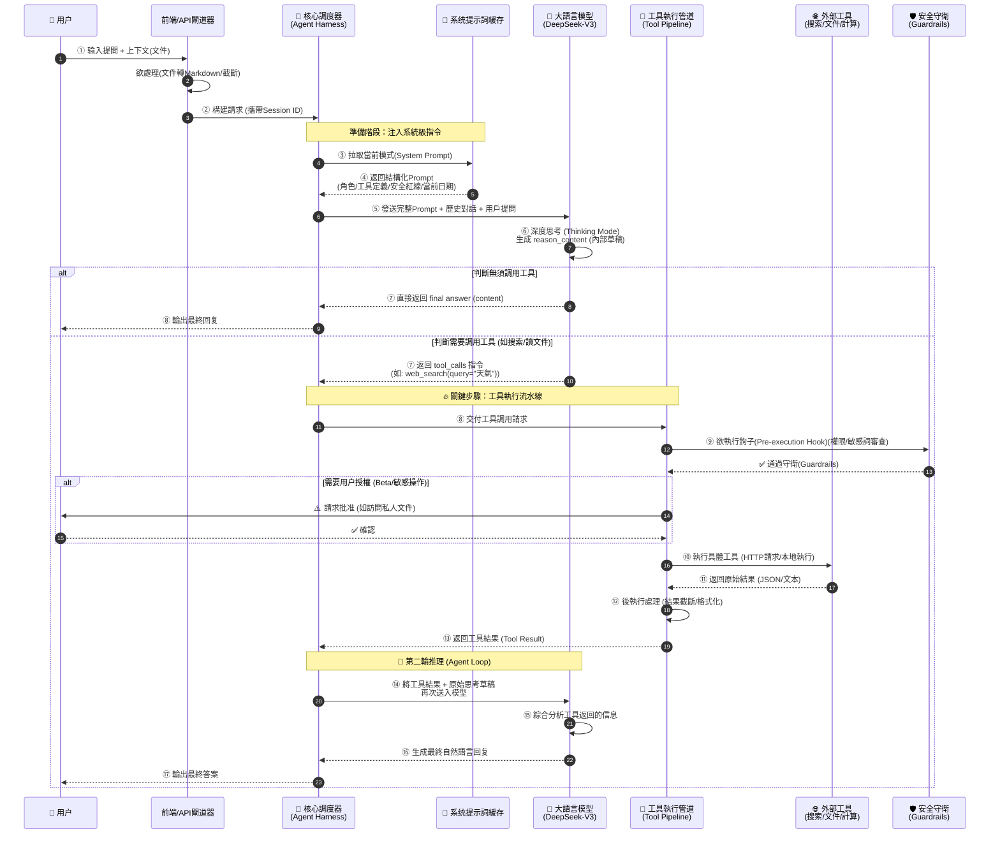

```mermaid
sequenceDiagram
    autonumber
    participant User as 👤 用户
    participant FE as 前端/API閘道器
    participant Harness as 🧠 核心調度器<br>(Agent Harness)
    participant System as 📜 系统提示詞緩存
    participant LLM as 🤖 大語言模型<br>(DeepSeek-V3)
    participant ToolPipe as 🔧 工具執行管道<br>(Tool Pipeline)
    participant ExtTool as 🌐 外部工具<br>(搜索/文件/計算)
    participant Safety as 🛡️ 安全守衛<br>(Guardrails)

    User->>FE: ① 输入提問 + 上下文(文件)
    FE->>FE: 欲處理(文件轉Markdown/截斷)
    FE->>Harness: ② 構建請求 (攜帶Session ID)

    Note over Harness,System: 準備階段：注入系統級指令
    Harness->>System: ③ 拉取當前模式(System Prompt)
    System-->>Harness: ④ 返回結構化Prompt<br>(角色/工具定義/安全紅線/當前日期)
   
    Harness->>LLM: ⑤ 發送完整Prompt + 歷史對話 + 用戶提問
    LLM->>LLM: ⑥ 深度思考 (Thinking Mode)<br>生成 reason_content (內部草稿)
   
    alt 判斷無須調用工具
        LLM-->>Harness: ⑦ 直接返回 final answer (content)
        Harness-->>User: ⑧ 輸出最終回复
    else 判斷需要調用工具 (如搜索/讀文件)
        LLM-->>Harness: ⑦ 返回 tool_calls 指令<br>(如: web_search(query="天氣"))
       
        Note over Harness,ToolPipe: 🔥 關鍵步驟：工具執行流水線
        Harness->>ToolPipe: ⑧ 交付工具調用請求
        ToolPipe->>Safety: ⑨ 欲執行鉤子(Pre-execution Hook)(權限/敏感詞審查)
        Safety-->>ToolPipe: ✅ 通過守衛(Guardrails)
       
        alt 需要用户授權 (Beta/敏感操作)
            ToolPipe->>User: ⚠️ 請求批准 (如訪問私人文件)
            User-->>ToolPipe: ✅ 確認
        end
       
        ToolPipe->>ExtTool: ⑩ 執行具體工具 (HTTP請求/本地執行)
        ExtTool-->>ToolPipe: ⑪ 返回原始結果 (JSON/文本)
        ToolPipe->>ToolPipe: ⑫ 後執行處理 (結果截斷/格式化)
        ToolPipe-->>Harness: ⑬ 返回工具結果 (Tool Result)
       
        Note over Harness,LLM: 🔄 第二輪推理 (Agent Loop)
        Harness->>LLM: ⑭ 將工具結果 + 原始思考草稿 <br>再次送入模型
        LLM->>LLM: ⑮ 綜合分析工具返回的信息
        LLM-->>Harness: ⑯ 生成最終自然語言回复
        Harness-->>User: ⑰ 輸出最終答案
    end
```